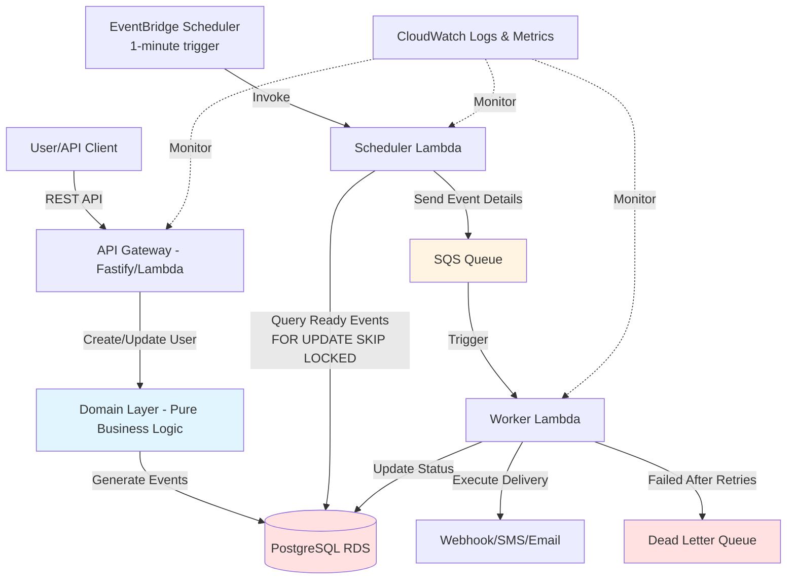

# Time-Based Event Scheduling System Architecture Document

## Introduction

This document outlines the overall project architecture for Time-Based Event Scheduling System, including backend systems, shared services, and non-UI specific concerns. Its primary goal is to serve as the guiding architectural blueprint for AI-driven development, ensuring consistency and adherence to chosen patterns and technologies.

**Relationship to Frontend Architecture:**
If the project includes a significant user interface, a separate Frontend Architecture Document will detail the frontend-specific design and MUST be used in conjunction with this document. Core technology stack choices documented herein (see "Tech Stack") are definitive for the entire project, including any frontend components.

### Starter Template or Existing Project

**Decision:** This is a greenfield project with **no starter template**.

The architecture will be built from scratch following Hexagonal Architecture + Domain-Driven Design patterns as outlined in the project brief. The repository structure is already well-defined with clear separation between domain, application, and adapter layers.

**Rationale:**
- The brief provides a complete architectural blueprint (Hexagonal Architecture + DDD)
- The repository structure is already well-defined for the chosen patterns
- Starting from scratch ensures full alignment with the architectural principles
- No existing frameworks like NestJS or other opinionated starters that might conflict with the clean architecture approach

### Change Log

| Date | Version | Description | Author |
|------|---------|-------------|--------|
| 2025-10-18 | 1.0 | Initial architecture document | Winston (Architect Agent) |
| 2025-10-19 | 2.0 | Reorganized into high-level overview with shard references | Claude |

---

## High Level Architecture

### Technical Summary

The Time-Based Event Scheduling System employs a **serverless event-driven architecture** built on AWS, utilizing a **polling-based scheduler** with **atomic event claiming** for exactly-once delivery guarantees. The system follows **Hexagonal Architecture with Domain-Driven Design** principles to ensure deployment portability across Lambda, containers, and Node processes. Core components include a timezone-aware event scheduler, SQS-buffered executor workers, and PostgreSQL for ACID transactions with advanced locking. This architecture directly supports the PRD's goals of reliable timezone-aware scheduling, exactly-once delivery, and automatic failure recovery while maintaining extensibility for future event types beyond birthday messaging.

### High Level Overview

**1. Architectural Style: Serverless Event-Driven Architecture with Polling Pattern**

The system uses AWS Lambda for compute, EventBridge for scheduled triggers, SQS for asynchronous message queuing, and RDS PostgreSQL for durable state storage. Unlike pure event-driven systems that react to data changes, this architecture employs a **polling scheduler** that periodically queries for events ready to execute.

**2. Repository Structure: Monorepo**

Single repository containing all services, shared domain logic, and infrastructure definitions. This simplifies dependency management, enables atomic cross-service changes, and supports the hexagonal architecture's emphasis on shared domain entities.

**3. Service Architecture: Modular Monolith with Deployment Flexibility**

- **Logical Services:** Scheduler, Executor, API Gateway (separate concerns)
- **Deployment Options:**
  - Lambda functions (production serverless)
  - Single Node process with background workers (local development)
  - Container deployment (Docker Compose for integration testing)
- **Key Principle:** Same codebase, swappable adapters for different deployment models

**4. Primary User/Data Flow:**

```
User API Request → Create User → Domain Logic → Generate Birthday Event → Store in PostgreSQL
                                                                               ↓
EventBridge (1-min) → Scheduler Lambda → Query Ready Events (FOR UPDATE SKIP LOCKED)
                                                ↓
                                         Send to SQS Queue
                                                ↓
                                    Worker Lambda ← SQS Trigger
                                                ↓
                                    Execute Webhook/SMS/Email
                                                ↓
                                    Update Event Status → COMPLETED/FAILED
```

**5. Key Architectural Decisions & Rationale:**

- **PostgreSQL over DynamoDB:** Requires ACID transactions and `FOR UPDATE SKIP LOCKED` for atomic event claiming (prevents race conditions). NoSQL solutions lack this locking mechanism.

- **Polling vs Event-Driven TTL:** DynamoDB TTL has 48-hour variance and no execution hooks. EventBridge scheduled polling provides 1-minute precision and guaranteed execution.

- **Hexagonal Architecture:** Core domain logic has zero dependencies on AWS, frameworks, or databases. Enables testing without infrastructure and supports future migration to other cloud providers or deployment models.

- **SQS Buffering:** Decouples scheduler from executor, provides retry logic, handles burst traffic, and enables horizontal scaling of workers independently from scheduler.

- **Optimistic Locking + State Machine:** Events have version numbers and enforced state transitions (PENDING → PROCESSING → COMPLETED) to prevent concurrent updates and ensure exactly-once delivery.

### High Level Project Diagram



### Architectural and Design Patterns

- **Hexagonal Architecture (Ports & Adapters):** Domain layer is pure TypeScript with zero framework dependencies, enabling testing without infrastructure. Adapters (HTTP, Lambda handlers, Prisma repositories) can be swapped without touching business logic. Critical for deployment portability - same codebase runs as Lambda, container, or Node process.

- **Domain-Driven Design (DDD):** Complex business rules (timezone conversions, event state transitions, exactly-once guarantees) belong in domain layer. Entities like `User` and `Event` encapsulate business invariants. Value objects like `Timezone`, `EventStatus`, `DateOfBirth` provide type safety and validation. Domain services like `TimezoneService` and `EventScheduler` contain pure business logic testable without infrastructure.

- **Repository Pattern:** `IUserRepository` and `IEventRepository` ports define contracts independent of database technology. Prisma adapter implements repositories, but could be swapped for TypeORM or raw SQL without changing use cases. Enables in-memory repositories for testing without database.

- **Lightweight CQRS:** Separate read/write use cases with single database. Write Side: `CreateUser`, `ScheduleEvent` use cases modify state. Read Side: `GetUser`, `QueryReadyEvents` use cases query state. Read replicas can be added later for query optimization without changing application code.

- **Retry Pattern with Exponential Backoff:** SQS provides built-in retry mechanism (configurable visibility timeout and max receive count). Exponential backoff prevents overwhelming external APIs during failures. Dead Letter Queue captures permanently failed events for manual inspection. Idempotency keys prevent duplicate executions during retries.

- **Optimistic Locking:** Version-based optimistic locking on events. Events have `version` field incremented on each update. Updates fail if version doesn't match (detects concurrent modification). Complements `FOR UPDATE SKIP LOCKED` as secondary safeguard against race conditions.

- **Strategy Pattern for Event Types:** Pluggable event handler architecture enables adding new event types (Anniversary, Reminder, Subscription) without modifying core scheduler logic. Each event type has its own strategy implementing `IEventHandler` interface with methods for event generation, message formatting, and delivery channel selection. Phase 1 implements `BirthdayEventHandler`; Phase 2+ adds additional handlers registered in an `EventHandlerRegistry`.

- **Factory Pattern for Event Creation:** `EventFactory` encapsulates complex event creation logic including timezone conversion, idempotency key generation, and payload formatting. Centralizes event instantiation rules and integrates with Strategy Pattern to delegate event-type-specific logic to handlers.

- **Chain of Responsibility for Validation:** Event validation uses composable validator chain (`EventStatusValidator`, `EventTimingValidator`, `EventRetryLimitValidator`) allowing validation rules to be added, removed, or reordered without modifying core business logic. Each validator has single responsibility and can fail fast or continue chain.

- **Observer Pattern for Event Lifecycle:** Event entities notify registered observers (`MetricsObserver`, `LoggingObserver`, `AuditObserver`) on status changes (created, claimed, completed, failed). Decouples event lifecycle from side effects like metrics collection and audit logging.

- **Builder Pattern for Test Data:** Test builders (`UserBuilder`, `EventBuilder`) provide fluent API for creating test fixtures with sensible defaults. Improves test readability and reduces boilerplate in unit and integration tests.

- **Template Method for Execution Flow:** Abstract execution use case defines common event execution flow (validate → execute → update status) while subclasses override delivery mechanism. Ensures consistent error handling and status updates across different delivery channels (webhook, SMS, email).

- **Specification Pattern for Queries:** Business rules encapsulated as composable specifications (`ReadyEventSpecification`, `OverdueEventSpecification`) enable complex query building using AND, OR, NOT operators. Keeps query logic in domain layer and allows reuse across repositories and use cases.

---

## Tech Stack

The system uses a modern TypeScript-based serverless stack built on AWS.

**Core Technologies:**

- **Language:** TypeScript 5.3.3 with strict mode
- **Runtime:** Node.js 20.11.0 LTS
- **Framework:** Fastify 4.26.0 (REST API with fastify-type-provider-zod 2.0.0)
- **Database:** PostgreSQL 16.1 (RDS)
- **ORM:** Prisma 5.9.1
- **Testing:** Jest 29.7.0
- **Date/Time:** Luxon 3.4.4 (IANA timezone support)

**AWS Services:**

- **Compute:** Lambda (scheduler and workers)
- **Scheduling:** EventBridge (1-minute triggers)
- **Messaging:** SQS (event buffering and retry)
- **Database:** RDS PostgreSQL
- **Monitoring:** CloudWatch (logs and metrics)
- **Future:** SNS (SMS), SES (email)

**Development Tools:**

- **IaC:** AWS CDK 2.122.0 (TypeScript)
- **CI/CD:** GitHub Actions
- **Local AWS:** LocalStack 3.1.0
- **Containerization:** Docker 24.0.7
- **Validation:** Zod 3.22.4
- **Logging:** Pino 8.17.2
- **HTTP Client:** Axios 1.6.7

See [**Tech Stack**](architecture/tech-stack.md) for complete technology stack with versions and rationale.

---

## Components Overview

The system is organized into **logical components** following Hexagonal Architecture principles. Each component has clear responsibilities, well-defined interfaces, and minimal coupling with other components. The components are organized by layer:

1. **Domain Layer** (Pure Business Logic)
2. **Application Layer** (Use Cases / Orchestration)
3. **Adapter Layer** (Infrastructure)

### API Gateway Component

**Responsibility:** Exposes REST API endpoints for user management and serves as the primary entry point for external clients. Handles HTTP request/response transformation, validation, and error handling.

**Key Interfaces:**

- `POST /user` - Create new user with birthday and timezone
- `GET /user/:id` - Retrieve user details by ID
- `PUT /user/:id` - Update user information (triggers event recalculation if birthday/timezone changes)
- `DELETE /user/:id` - Delete user and associated events
- `GET /health` - Health check endpoint for monitoring

**Dependencies:**

- Application Layer: `CreateUserUseCase`, `GetUserUseCase`, `UpdateUserUseCase`, `DeleteUserUseCase`
- Shared: Zod validation schemas, Pino logger, error handling middleware

**Deployment Options:**

- **Lambda:** Wrapped in `@fastify/aws-lambda` adapter for API Gateway integration
- **Container:** Standalone Fastify server listening on port 3000
- **Local Development:** Fastify server with hot reload (nodemon)

### Scheduler Component

**Responsibility:** Periodically queries for events that are ready to execute and dispatches them to the executor. Implements atomic event claiming to prevent race conditions and ensure exactly-once delivery.

**Key Operations:**

- Main entry point triggered by EventBridge every 1 minute
- Query: `SELECT * FROM events WHERE targetTimestampUTC <= NOW() AND status = 'PENDING' FOR UPDATE SKIP LOCKED LIMIT 100`

**Dependencies:**

- Application Layer: `ClaimReadyEventsUseCase`
- Adapter Layer: `PrismaEventRepository`, `SQSMessageSender`
- Domain Layer: `Event` entity, `EventStatus` value object

**Deployment Options:**

- **Lambda:** Triggered by EventBridge every 1 minute
- **Container/Local:** Background Node process with `setInterval(60000)` polling

**Concurrency Handling:**

- `FOR UPDATE SKIP LOCKED` ensures only one scheduler instance claims each event
- Optimistic locking (version field) as secondary safeguard
- Transaction isolation level: READ COMMITTED

### Executor Component (Worker)

**Responsibility:** Consumes events from SQS queue, executes delivery actions (webhook/SMS/email), and updates event status. Implements retry logic with exponential backoff and idempotency guarantees.

**Key Operations:**

- Process events from SQS queue
- Webhook delivery: `POST <webhook-url>` with JSON payload
- Future: SMS delivery via SNS, Email delivery via SES

**Dependencies:**

- Application Layer: `ExecuteEventUseCase`
- Adapter Layer: `WebhookDeliveryAdapter`, `PrismaEventRepository`
- Domain Layer: `Event` entity, domain services for delivery

**Deployment Options:**

- **Lambda:** Triggered by SQS queue (batch size: 10, visibility timeout: 30s)
- **Container/Local:** Background worker polling SQS with long polling

**Retry Strategy:**

- SQS visibility timeout: 30 seconds
- Max receive count: 3 (after 3 failures, move to Dead Letter Queue)
- Exponential backoff: 1s, 2s, 4s between retries
- Idempotency key sent with every webhook call to prevent duplicates

---

## Detailed Architecture Documentation

This architecture is organized into focused documents for easier navigation:

### Core Domain & Design

- **[Data Models](architecture/data-models.md)** - Domain entities (User, Event) and value objects (Timezone, EventStatus, DateOfBirth, IdempotencyKey)
- **[Design Patterns](architecture/design-patterns.md)** - All 7 design patterns with complete implementations (Strategy, Factory, Chain of Responsibility, Observer, Specification, Builder, Template Method)
- **[Port Interfaces](architecture/port-interfaces.md)** - Application layer boundaries (IUserRepository, IEventRepository, IMessageSender, IDeliveryAdapter)

### Implementation Details

- **[Source Tree](architecture/source-tree.md)** - Complete file structure with Hexagonal Architecture organization
- **[Database Schema](architecture/database-schema.md)** - PostgreSQL schema with indexes, triggers, and constraints
- **[Workflows](architecture/workflows.md)** - Sequence diagrams for all 4 core workflows

### Development & Operations

- **[Tech Stack](architecture/tech-stack.md)** - Complete technology stack with versions and rationale
- **[Coding Standards](architecture/coding-standards.md)** - Mandatory coding rules and conventions
- **[Test Strategy](architecture/test-strategy.md)** - Testing philosophy, organization, and Builder pattern examples
- **[Error Handling](architecture/error-handling.md)** - Error hierarchy, logging standards, and retry patterns
- **[Security](architecture/security.md)** - Input validation, secrets management, and security testing
- **[Infrastructure](architecture/infrastructure.md)** - AWS CDK, CI/CD pipeline, and deployment strategy

---

## Next Steps

### For Development

1. **Review Core Domain:** Start with [Data Models](architecture/data-models.md) to understand domain entities
2. **Understand Patterns:** Read [Design Patterns](architecture/design-patterns.md) for implementation patterns
3. **Study Workflows:** Review [Workflows](architecture/workflows.md) for end-to-end flow understanding
4. **Check Standards:** Consult [Coding Standards](architecture/coding-standards.md) before writing code
5. **Follow Source Tree:** Use [Source Tree](architecture/source-tree.md) for file organization

### For Implementation Phases

#### Phase 1: Foundation (Weeks 1-2)

- Set up repository structure per [Source Tree](architecture/source-tree.md)
- Implement database schema per [Database Schema](architecture/database-schema.md)
- Create domain entities per [Data Models](architecture/data-models.md)
- Set up infrastructure per [Infrastructure](architecture/infrastructure.md)
- Implement test framework per [Test Strategy](architecture/test-strategy.md)

#### Phase 2: Core Features (Weeks 3-4)

- Implement API endpoints (User CRUD)
- Build scheduler component with atomic event claiming
- Develop executor component with webhook delivery
- Add comprehensive error handling per [Error Handling](architecture/error-handling.md)
- Implement security measures per [Security](architecture/security.md)

#### Phase 3: Testing & Reliability (Week 5)

- Unit tests for domain layer
- Integration tests with Testcontainers
- End-to-end tests with LocalStack
- Load testing for scheduler concurrency
- Security testing per [Security](architecture/security.md)

#### Phase 4: Deployment & Monitoring (Week 6)

- Deploy infrastructure with AWS CDK
- Set up CI/CD pipeline per [Infrastructure](architecture/infrastructure.md)
- Configure CloudWatch dashboards and alarms
- Test production deployment
- Documentation and handoff

### For AI-Driven Development

**Dev Agent Instructions:**

- Load [Coding Standards](architecture/coding-standards.md) for every coding session
- Follow Hexagonal Architecture principles strictly (zero framework dependencies in domain layer)
- Implement domain layer first (pure business logic)
- Use Test-Driven Development (write tests first)
- Refer to [Design Patterns](architecture/design-patterns.md) for implementation guidance
- Check [Port Interfaces](architecture/port-interfaces.md) for adapter contracts
- Follow [Test Strategy](architecture/test-strategy.md) for test organization
- Apply [Error Handling](architecture/error-handling.md) standards consistently
- Implement [Security](architecture/security.md) requirements for all user inputs

**Architecture Principles:**

1. **Domain First:** Domain entities and value objects have no external dependencies
2. **Port Contracts:** Define interfaces before implementations
3. **Test Coverage:** Every use case has unit tests, every adapter has integration tests
4. **Immutability:** Prefer immutable value objects and domain entities
5. **Type Safety:** Leverage TypeScript strict mode and Zod validation
6. **Fail Fast:** Validate at boundaries (API, repository, external services)
7. **Observability:** Log all state transitions, errors, and external calls

---

**Document Version:** 2.0
**Last Updated:** 2025-10-19
**Maintained By:** Architecture Team
