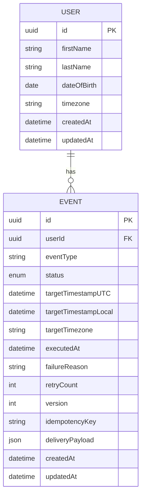

# Data Models

**Domain entities and value objects for the Time-Based Event Scheduling System**

Reference: [Full Architecture Document](../architecture.md)

---

## Data Models Overview

The system is built around two core domain entities that represent the business domain:

1. **User** - Represents an individual with a birthday and timezone
2. **Event** - Represents a scheduled birthday message for a user

Additionally, we use **Value Objects** (DDD pattern) for type-safe, validated data:

1. **Timezone** - IANA timezone string with validation
2. **EventStatus** - Enumerated event lifecycle states
3. **DateOfBirth** - Validated date representing a user's birthday
4. **IdempotencyKey** - Unique key for preventing duplicate deliveries

---

## User

**Purpose:** Represents an individual person with a birthday that should be celebrated. The User entity encapsulates user identity and the data necessary to calculate when birthday events should occur.

**Key Attributes:**

- `id: UUID` - Unique identifier for the user (generated on creation)
- `firstName: string` - User's first name (required, 1-100 characters)
- `lastName: string` - User's last name (required, 1-100 characters)
- `dateOfBirth: DateOfBirth` - User's birthday as YYYY-MM-DD (required, validated value object)
- `timezone: Timezone` - User's IANA timezone (required, validated value object, e.g., "America/New_York")
- `createdAt: DateTime` - Timestamp when user was created (UTC)
- `updatedAt: DateTime` - Timestamp when user was last modified (UTC)

**Relationships:**

- **One-to-Many with Event:** A user has zero or more birthday events (one per year). When a user is created, the system automatically generates their next birthday event. When an event executes, a new event for the following year is generated.
- **Cascade Delete:** When a user is deleted, all associated events are deleted (orphan removal).

**Business Invariants:**

- First name and last name cannot be empty strings
- Date of birth must be a valid date in the past
- Timezone must be a valid IANA timezone identifier
- Date of birth cannot be in the future (validated at creation/update)

**Domain Behaviors:**

- `calculateNextBirthday(currentDate: DateTime): DateTime` - Calculates the next occurrence of the user's birthday in their local timezone
- `updateTimezone(newTimezone: Timezone): void` - Updates timezone and triggers recalculation of pending events

---

## Event

**Purpose:** Represents a scheduled birthday message for a specific user at a specific time. Events are the core of the scheduling system and track the lifecycle from creation through execution.

**Key Attributes:**

- `id: UUID` - Unique identifier for the event
- `userId: UUID` - Foreign key to User (required, indexed)
- `eventType: string` - Type of event (hardcoded to "BIRTHDAY" for Phase 1, extensible for Phase 2+)
- `status: EventStatus` - Current lifecycle state (enum: PENDING, PROCESSING, COMPLETED, FAILED)
- `targetTimestampUTC: DateTime` - When the event should execute (UTC, indexed for scheduler queries)
- `targetTimestampLocal: DateTime` - When the event should execute in user's local time (for display/debugging)
- `targetTimezone: string` - Timezone used for calculation (stored for audit trail, may differ from user's current timezone if they changed it)
- `executedAt: DateTime | null` - Actual execution timestamp (null until executed)
- `failureReason: string | null` - Error message if status is FAILED
- `retryCount: number` - Number of execution attempts (default 0, max 3)
- `version: number` - Optimistic locking version (incremented on each update)
- `idempotencyKey: string` - Unique key for external API calls (prevents duplicate webhook sends on retry)
- `deliveryPayload: JSON` - Message payload to deliver (e.g., `{"message": "Hey, John Doe it's your birthday"}`)
- `createdAt: DateTime` - Timestamp when event was created (UTC)
- `updatedAt: DateTime` - Timestamp when event was last modified (UTC)

**Relationships:**

- **Many-to-One with User:** Each event belongs to exactly one user (required foreign key)
- **Cascade on User Delete:** If user is deleted, all associated events are deleted

**Business Invariants:**

- Status transitions must follow state machine: PENDING → PROCESSING → (COMPLETED | FAILED)
- Cannot transition from COMPLETED or FAILED back to PENDING
- Target timestamp cannot be modified after event enters PROCESSING state
- Retry count cannot exceed 3
- Version must increment on every update (optimistic locking)

**Domain Behaviors:**

- `claim(): void` - Atomically transitions from PENDING → PROCESSING (used by scheduler)
- `markCompleted(executedAt: DateTime): void` - Transitions to COMPLETED state
- `markFailed(reason: string): void` - Transitions to FAILED state (increments retry count if < 3)
- `canRetry(): boolean` - Returns true if retry count < 3 and status is FAILED
- `generateIdempotencyKey(): string` - Creates unique key for external API idempotency

---

## Timezone (Value Object)

**Purpose:** Type-safe wrapper for IANA timezone identifiers with validation. Ensures only valid timezones are used throughout the system.

**Structure:**

```typescript
class Timezone {
  private readonly value: string;

  constructor(value: string) {
    if (!Timezone.isValid(value)) {
      throw new InvalidTimezoneError(value);
    }
    this.value = value;
  }

  static isValid(tz: string): boolean {
    // Validate against IANA timezone database using Luxon
  }

  toString(): string {
    return this.value;
  }

  equals(other: Timezone): boolean {
    return this.value === other.value;
  }
}
```

**Rationale:** Prevents invalid timezone strings from entering the domain. Encapsulates validation logic in a single place.

---

## EventStatus (Value Object / Enum)

**Purpose:** Enumerated type representing the event lifecycle states with enforced state machine transitions.

**States:**

- `PENDING` - Event created, waiting for target time
- `PROCESSING` - Event claimed by scheduler, being executed
- `COMPLETED` - Event successfully executed
- `FAILED` - Event execution failed after max retries

**State Machine:**

```text
PENDING → PROCESSING → COMPLETED
              ↓
            FAILED
```

**Validation Rules:**

- Cannot transition from COMPLETED or FAILED to any other state
- Cannot skip states (e.g., PENDING → COMPLETED without PROCESSING)

---

## DateOfBirth (Value Object)

**Purpose:** Type-safe representation of a date of birth with validation rules specific to birthdays.

**Structure:**

```typescript
class DateOfBirth {
  private readonly value: DateTime; // Luxon DateTime

  constructor(dateString: string) {
    const parsed = DateTime.fromISO(dateString);
    if (!parsed.isValid) {
      throw new InvalidDateOfBirthError(dateString);
    }
    if (parsed > DateTime.now()) {
      throw new DateOfBirthInFutureError(dateString);
    }
    this.value = parsed;
  }

  getMonthDay(): { month: number; day: number } {
    return { month: this.value.month, day: this.value.day };
  }

  calculateNextOccurrence(timezone: Timezone): DateTime {
    // Calculate next birthday in user's timezone
  }

  toString(): string {
    return this.value.toISODate(); // YYYY-MM-DD
  }
}
```

**Rationale:** Encapsulates birthday-specific logic (calculating next occurrence, handling leap years). Prevents invalid dates from entering the system.

---

## IdempotencyKey (Value Object)

**Purpose:** Generates unique, deterministic keys for preventing duplicate event deliveries during retries.

**Structure:**

```typescript
class IdempotencyKey {
  private readonly value: string;

  private constructor(value: string) {
    this.value = value;
  }

  static generate(userId: string, targetTimestampUTC: DateTime): IdempotencyKey {
    // Deterministic key: hash(userId + targetTimestampUTC + eventType)
    const keyData = `${userId}-${targetTimestampUTC.toISO()}-BIRTHDAY`;
    const hash = crypto.createHash('sha256').update(keyData).digest('hex');
    return new IdempotencyKey(`event-${hash.substring(0, 16)}`);
  }

  toString(): string {
    return this.value;
  }

  equals(other: IdempotencyKey): boolean {
    return this.value === other.value;
  }
}
```

**Rationale:** Ensures that if the same event is retried (due to transient failure), the external webhook endpoint receives the same idempotency key and can deduplicate.

---

## Entity Relationship Diagram



---
