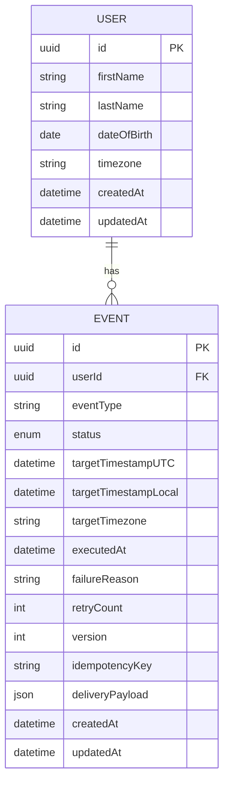

# Data Models

**Domain entities and value objects for the Time-Based Event Scheduling System**

Reference: [Full Architecture Document](../architecture.md)

---

## Data Models Overview

The system is built around two core domain entities that represent the business domain:

1. **User** - Represents an individual with a birthday and timezone
2. **Event** - Represents a scheduled birthday message for a user

Additionally, we use **Value Objects** (DDD pattern) for type-safe, validated data:

1. **Timezone** - IANA timezone string with validation
2. **EventStatus** - Enumerated event lifecycle states
3. **DateOfBirth** - Validated date representing a user's birthday
4. **IdempotencyKey** - Unique key for preventing duplicate deliveries

---

## User

**Purpose:** Represents an individual person with a birthday that should be celebrated. The User entity encapsulates user identity and the data necessary to calculate when birthday events should occur.

**Key Attributes:**

- `id: UUID` - Unique identifier for the user (generated on creation)
- `firstName: string` - User's first name (required, 1-100 characters)
- `lastName: string` - User's last name (required, 1-100 characters)
- `dateOfBirth: DateOfBirth` - User's birthday as YYYY-MM-DD (required, validated value object)
- `timezone: Timezone` - User's IANA timezone (required, validated value object, e.g., "America/New_York")
- `createdAt: DateTime` - Timestamp when user was created (UTC)
- `updatedAt: DateTime` - Timestamp when user was last modified (UTC)

**Relationships:**

- **One-to-Many with Event:** A user has zero or more birthday events (one per year). When a user is created, the system automatically generates their next birthday event. When an event executes, a new event for the following year is generated.
- **Cascade Delete:** When a user is deleted, all associated events are deleted (orphan removal).

**Business Invariants:**

- First name and last name cannot be empty strings
- Date of birth must be a valid date in the past
- Timezone must be a valid IANA timezone identifier
- Date of birth cannot be in the future (validated at creation/update)

**Domain Behaviors:**

- `updateTimezone(newTimezone: Timezone): void` - Updates timezone and triggers recalculation of pending events
- `updateName(firstName: string, lastName: string): void` - Updates user's name

**Note:** Birthday calculation logic moved to `BirthdayEventHandler` (Strategy Pattern - Story 1.5). Use `BirthdayEventHandler.calculateNextOccurrence(user)` instead of `user.calculateNextBirthday()`.

---

## Event

**Purpose:** Represents a scheduled birthday message for a specific user at a specific time. Events are the core of the scheduling system and track the lifecycle from creation through execution.

**Key Attributes:**

- `id: UUID` - Unique identifier for the event
- `userId: UUID` - Foreign key to User (required, indexed)
- `eventType: string` - Type of event (hardcoded to "BIRTHDAY" for Phase 1, extensible for Phase 2+)
- `status: EventStatus` - Current lifecycle state (enum: PENDING, PROCESSING, COMPLETED, FAILED)
- `targetTimestampUTC: DateTime` - When the event should execute (UTC, indexed for scheduler queries)
- `targetTimestampLocal: DateTime` - When the event should execute in user's local time (for display/debugging)
- `targetTimezone: string` - Timezone used for calculation (stored for audit trail, may differ from user's current timezone if they changed it)
- `executedAt: DateTime | null` - Actual execution timestamp (null until executed)
- `failureReason: string | null` - Error message if status is FAILED
- `retryCount: number` - Number of execution attempts (default 0, max 3)
- `version: number` - Optimistic locking version (incremented on each update)
- `idempotencyKey: string` - Unique key for external API calls (prevents duplicate webhook sends on retry)
- `deliveryPayload: JSON` - Message payload to deliver (e.g., `{"message": "Hey, John Doe it's your birthday"}`)
- `createdAt: DateTime` - Timestamp when event was created (UTC)
- `updatedAt: DateTime` - Timestamp when event was last modified (UTC)

**Relationships:**

- **Many-to-One with User:** Each event belongs to exactly one user (required foreign key)
- **Cascade on User Delete:** If user is deleted, all associated events are deleted

**Business Invariants:**

- Status transitions must follow state machine: PENDING → PROCESSING → (COMPLETED | FAILED)
- Cannot transition from COMPLETED or FAILED back to PENDING
- Target timestamp cannot be modified after event enters PROCESSING state
- Retry count cannot exceed 3
- Version must increment on every update (optimistic locking)

**Domain Behaviors:**

- `claim(): void` - Atomically transitions from PENDING → PROCESSING (used by scheduler)
- `markCompleted(executedAt: DateTime): void` - Transitions to COMPLETED state
- `markFailed(reason: string): void` - Transitions to FAILED state (increments retry count if < 3)
- `canRetry(): boolean` - Returns true if retry count < 3 and status is FAILED
- `generateIdempotencyKey(): string` - Creates unique key for external API idempotency

---

## Timezone (Value Object)

**Purpose:** Type-safe wrapper for IANA timezone identifiers with validation. Ensures only valid timezones are used throughout the system.

**Structure:**

```typescript
class Timezone {
  private readonly value: string;

  constructor(value: string) {
    if (!Timezone.isValid(value)) {
      throw new InvalidTimezoneError(value);
    }
    this.value = value;
  }

  static isValid(tz: string): boolean {
    // Validate against IANA timezone database using Luxon
  }

  toString(): string {
    return this.value;
  }

  equals(other: Timezone): boolean {
    return this.value === other.value;
  }
}
```

**Rationale:** Prevents invalid timezone strings from entering the domain. Encapsulates validation logic in a single place.

---

## EventStatus (Value Object / Enum)

**Purpose:** Enumerated type representing the event lifecycle states with enforced state machine transitions.

**States:**

- `PENDING` - Event created, waiting for target time
- `PROCESSING` - Event claimed by scheduler, being executed
- `COMPLETED` - Event successfully executed
- `FAILED` - Event execution failed after max retries

**State Machine:**

```text
PENDING → PROCESSING → COMPLETED
              ↓
            FAILED
```

**Validation Rules:**

- Cannot transition from COMPLETED or FAILED to any other state
- Cannot skip states (e.g., PENDING → COMPLETED without PROCESSING)

---

## DateOfBirth (Value Object)

**Purpose:** Type-safe representation of a date of birth with validation rules specific to birthdays.

**Structure:**

```typescript
class DateOfBirth {
  private readonly value: DateTime; // Luxon DateTime

  constructor(dateString: string) {
    const parsed = DateTime.fromISO(dateString);
    if (!parsed.isValid) {
      throw new InvalidDateOfBirthError(dateString);
    }
    if (parsed > DateTime.now()) {
      throw new DateOfBirthInFutureError(dateString);
    }
    this.value = parsed;
  }

  getMonthDay(): { month: number; day: number } {
    return { month: this.value.month, day: this.value.day };
  }

  toString(): string {
    return this.value.toISODate(); // YYYY-MM-DD
  }

  equals(other: DateOfBirth): boolean {
    return this.value.equals(other.value);
  }
}

// Note: calculateNextOccurrence() method removed in Story 1.5
// Birthday calculation moved to BirthdayEventHandler (Strategy Pattern)
```

**Rationale:** Encapsulates birthday-specific logic (calculating next occurrence, handling leap years). Prevents invalid dates from entering the system.

---

## IdempotencyKey (Value Object)

**Purpose:** Generates unique, deterministic keys for preventing duplicate event deliveries during retries.

The IdempotencyKey ensures that if an event execution fails due to transient errors (network timeouts, temporary service unavailability), retry attempts will send the same idempotency key to the external webhook endpoint. This allows the receiving service to detect and ignore duplicate requests, guaranteeing **exactly-once delivery semantics** even when the system retries multiple times.

**Key Properties:**

- **Deterministic:** Same userId + targetTimestampUTC + eventType always produces the same key
- **Unique:** Different inputs always produce different keys (SHA-256 collision probability is negligible)
- **Immutable:** Once generated for an event, the key never changes through state transitions
- **Persistent:** Stored in database and included in all webhook requests

**Structure:**

```typescript
class IdempotencyKey {
  private readonly value: string;

  private constructor(value: string) {
    this.value = value;
  }

  static generate(userId: string, targetTimestampUTC: DateTime): IdempotencyKey {
    // Deterministic key: hash(userId + targetTimestampUTC + eventType)
    const keyData = `${userId}-${targetTimestampUTC.toISO()}-BIRTHDAY`;
    const hash = crypto.createHash('sha256').update(keyData).digest('hex');
    return new IdempotencyKey(`event-${hash.substring(0, 16)}`);
  }

  static fromString(value: string): IdempotencyKey {
    return new IdempotencyKey(value);
  }

  toString(): string {
    return this.value;
  }

  equals(other: IdempotencyKey): boolean {
    return this.value === other.value;
  }
}
```

**Key Format:** `event-{16_character_sha256_hash}`

**Example:** `event-a1b2c3d4e5f6g7h8`

**Generation Algorithm:**

1. Concatenate: `userId + "-" + targetTimestampUTC.toISO() + "-" + eventType`
2. Hash: Apply SHA-256 cryptographic hash function
3. Truncate: Take first 16 characters of hex digest
4. Format: Prefix with `"event-"` to create final key

**Why SHA-256 Hash Instead of Plain IDs?**

- **Security:** Doesn't expose internal user IDs or event timestamps to external systems
- **Consistency:** Fixed 24-character length regardless of input length
- **Collision Resistance:** SHA-256 makes accidental duplicates virtually impossible
- **Privacy:** External webhook services cannot reverse-engineer user data from the key

**Deterministic Behavior Guarantee:**

Given the same inputs, `IdempotencyKey.generate()` will **always** produce identical output:

```typescript
// These two calls produce identical keys:
const key1 = IdempotencyKey.generate('user-123', DateTime.fromISO('2025-03-15T14:00:00Z'));
const key2 = IdempotencyKey.generate('user-123', DateTime.fromISO('2025-03-15T14:00:00Z'));

key1.equals(key2); // true
key1.toString() === key2.toString(); // true
```

**Webhook Header Usage:**

The idempotency key is sent to webhook endpoints in the `X-Idempotency-Key` HTTP header:

```http
POST /webhook HTTP/1.1
Host: example.com
Content-Type: application/json
X-Idempotency-Key: event-a1b2c3d4e5f6g7h8

{
  "message": "Hey, John Doe it's your birthday"
}
```

**Retry Consistency:**

When an event execution fails with a transient error (503 Service Unavailable, network timeout), the system retries the webhook delivery. All retry attempts use the **same idempotency key**:

```
Attempt 1: X-Idempotency-Key: event-a1b2c3d4e5f6g7h8  (fails with 503)
Attempt 2: X-Idempotency-Key: event-a1b2c3d4e5f6g7h8  (fails with timeout)
Attempt 3: X-Idempotency-Key: event-a1b2c3d4e5f6g7h8  (succeeds)
```

The external webhook service can use this header to detect duplicates and avoid processing the same event multiple times.

**External Webhook Service Configuration:**

**Testing with RequestBin/webhook.site:**

For development and integration testing, you can use services like RequestBin or webhook.site to inspect idempotency keys:

1. **Create endpoint:** Visit https://requestbin.com or https://webhook.site to create a test endpoint
2. **Configure environment variable:**
   ```bash
   WEBHOOK_TEST_URL=https://your-endpoint-id.requestbin.com
   ```
3. **Run integration tests:** Execute your webhook delivery tests
4. **View requests:** Open the RequestBin dashboard to see all incoming requests
5. **Verify idempotency:** Check that retry attempts have identical `X-Idempotency-Key` headers

**Important:** RequestBin and webhook.site are **passive inspection tools**—they log requests but do NOT enforce idempotency automatically. They allow you to verify that the system sends the correct headers.

**Production Webhook Implementation:**

For production webhook endpoints, the receiving service must implement idempotency logic:

```typescript
// Example: Webhook receiver implementing idempotency
app.post('/webhook', async (req, res) => {
  const idempotencyKey = req.headers['x-idempotency-key'];

  // Check if this key was already processed
  const alreadyProcessed = await db.processedKeys.exists(idempotencyKey);

  if (alreadyProcessed) {
    // Duplicate request - return success without reprocessing
    return res.status(200).json({ success: true, duplicate: true });
  }

  // Process the webhook payload
  await processWebhook(req.body);

  // Store the idempotency key to prevent future duplicates
  await db.processedKeys.save(idempotencyKey, { expiresIn: '7 days' });

  return res.status(200).json({ success: true });
});
```

**Logging and Debugging:**

All log statements related to event execution include the idempotency key for request tracing:

```typescript
logger.info({
  msg: 'Executing event',
  eventId: 'event-123',
  idempotencyKey: 'event-a1b2c3d4e5f6g7h8',
  userId: 'user-456',
  targetTimestampUTC: '2025-03-15T14:00:00Z'
});
```

**Example Log Output:**

```json
{
  "level": "info",
  "msg": "Webhook delivery succeeded",
  "eventId": "event-123",
  "idempotencyKey": "event-a1b2c3d4e5f6g7h8",
  "statusCode": 200,
  "durationMs": 245,
  "timestamp": "2025-03-15T14:00:01.245Z"
}
```

Use the `idempotencyKey` field to correlate logs across multiple retry attempts and trace the complete lifecycle of an event execution.

**Database Storage:**

The idempotency key is stored in the `events` table with a unique constraint:

```sql
CREATE TABLE events (
  id UUID PRIMARY KEY,
  idempotency_key VARCHAR(255) UNIQUE NOT NULL,
  -- ... other columns
);
```

The unique constraint prevents accidental creation of duplicate events with the same idempotency key, providing an additional layer of data integrity.

**Rationale:** Ensures that if the same event is retried (due to transient failure), the external webhook endpoint receives the same idempotency key and can deduplicate, achieving exactly-once delivery semantics.

---

## Entity Relationship Diagram



---
