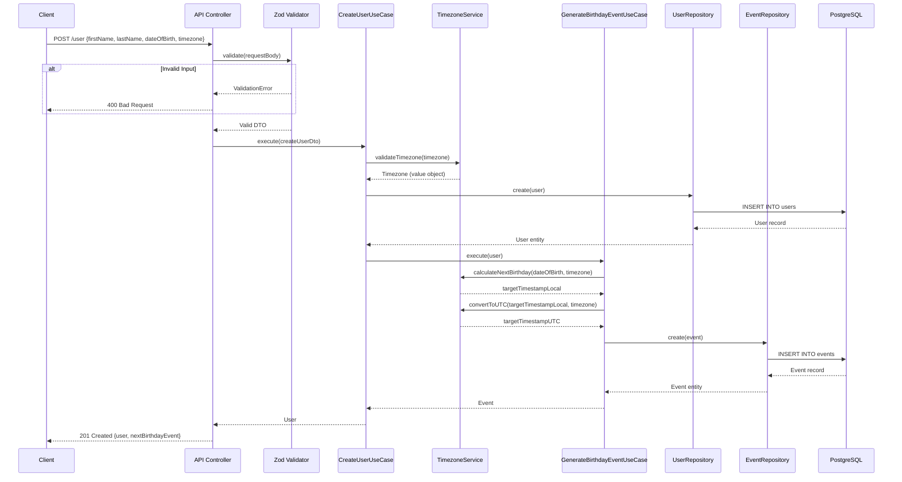
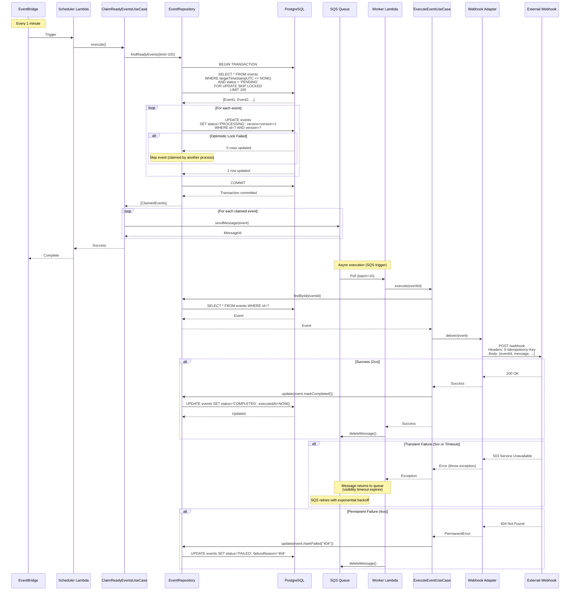
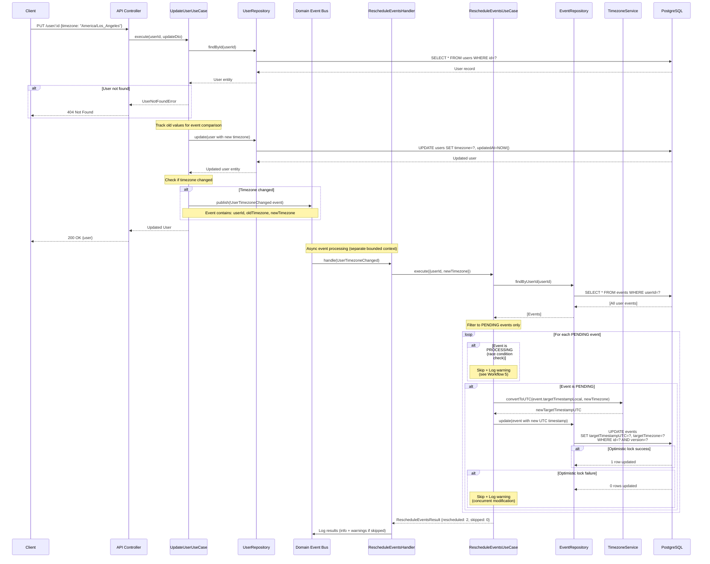
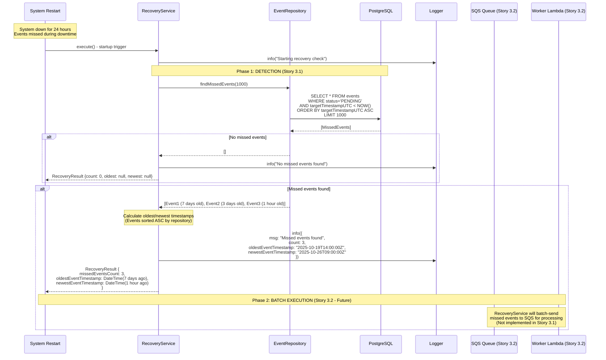
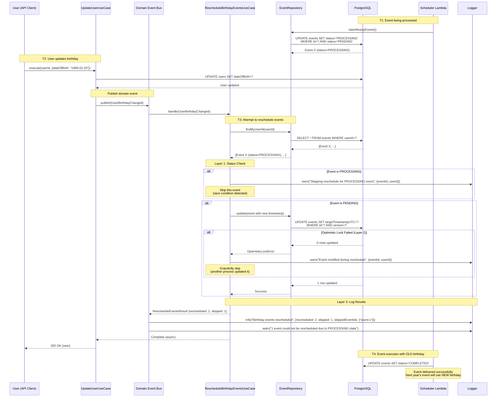

# Core Workflows

This section illustrates key system workflows using sequence diagrams to show component interactions, including error handling paths and async operations.

Reference: [Full Architecture Document](../architecture.md)

---

## Workflow 1: User Creation and Initial Event Generation



**Key Points:**

- Input validation happens at API boundary before reaching use cases
- Timezone validation ensures only valid IANA timezones are accepted
- Event generation is atomic with user creation (both succeed or both fail)
- Domain logic (timezone calculations) isolated in TimezoneService
- Database transactions ensure consistency

---

## Workflow 2: Scheduled Event Claiming and Execution



**Key Points:**

- `FOR UPDATE SKIP LOCKED` prevents race conditions (events locked by one scheduler instance are skipped by others)
- Optimistic locking (version field) provides secondary safeguard
- SQS decouples scheduler from executor (scheduler doesn't wait for webhook calls)
- Idempotency key prevents duplicate deliveries on retry
- Transient failures (5xx, timeout) trigger automatic retries via SQS
- Permanent failures (4xx) are marked FAILED without retry

---

## Workflow 3: User Update with Event-Driven Rescheduling

**Status: UPDATED for Event-Driven Architecture** ✅

This workflow shows how user updates (DOB/timezone) trigger event rescheduling via domain events, maintaining bounded context separation.



**Key Points:**

- ✅ **Bounded Context Separation:** UpdateUserUseCase (User Context) does NOT directly access EventRepository (Event Scheduling Context)
- ✅ **Event-Driven Architecture:** Communication via domain events (UserTimezoneChanged, UserBirthdayChanged)
- ✅ **Async Processing:** Event rescheduling happens asynchronously (doesn't block API response)
- ✅ **Race Condition Protection:** PROCESSING events are skipped (see Workflow 5 for details)
- ✅ **Optimistic Locking:** Version field prevents concurrent modification conflicts
- ✅ **Comprehensive Logging:** Reschedule results logged including skipped events
- ⚠️ **User Response:** Client receives updated user immediately (reschedule status NOT in response - happens async)

**Domain Events:**

- `UserBirthdayChanged` - Published when dateOfBirth changes
- `UserTimezoneChanged` - Published when timezone changes

**Event Handlers:**

- `RescheduleEventsOnUserBirthdayChangedHandler` → delegates to `RescheduleBirthdayEventsUseCase`
- `RescheduleEventsOnUserTimezoneChangedHandler` → delegates to `RescheduleEventsOnTimezoneChangeUseCase`

**Related Workflows:**

- See **Workflow 5** for race condition protection details when PROCESSING events are encountered

---

## Workflow 4: Failure Recovery After System Downtime

**Status: DETECTION IMPLEMENTED in Story 3.1** ✅ | **EXECUTION in Story 3.2** ⏳

This workflow shows how the system detects and handles missed events after system downtime. The workflow is split into two phases:

1. **Phase 1 (Story 3.1):** Detection - RecoveryService identifies missed events and logs them
2. **Phase 2 (Story 3.2):** Execution - Batch processing via SQS to execute missed events



**Phase 1: Detection Only (Story 3.1)** ✅

RecoveryService is **READ-ONLY** in Story 3.1:

```typescript
// RecoveryService.execute() - Detection only
const missedEvents = await this.eventRepository.findMissedEvents(1000);

if (missedEvents.length === 0) {
  this.logger.info('No missed events found');
  return { missedEventsCount: 0, oldestEventTimestamp: null, newestEventTimestamp: null };
}

const oldestEventTimestamp = missedEvents[0]!.targetTimestampUTC;
const newestEventTimestamp = missedEvents[missedEvents.length - 1]!.targetTimestampUTC;

this.logger.info({
  msg: 'Missed events found',
  count: missedEvents.length,
  oldestEventTimestamp: oldestEventTimestamp.toISO(),
  newestEventTimestamp: newestEventTimestamp.toISO(),
});

return { missedEventsCount, oldestEventTimestamp, newestEventTimestamp };
```

**Why Detection-Only in Story 3.1?**

- ✅ **Separation of Concerns:** Detection ≠ Execution
- ✅ **Observability First:** Get visibility into missed events before automating recovery
- ✅ **Safe MVP:** Detect issues without risk of accidentally re-executing events
- ✅ **Story 3.2 Prep:** Lays groundwork for batch SQS processing

**Phase 2: Batch Execution (Story 3.2 - Future)** ⏳

In Story 3.2, RecoveryService will:

1. Detect missed events (same as Phase 1)
2. Batch-send events to SQS in groups of 10 using `SendMessageBatch`
3. Worker Lambda will claim and execute events using existing `ClaimReadyEventsUseCase`
4. Respects 1000-event limit per recovery run (prevents memory overflow)

**Key Points:**

- ✅ **Story 3.1:** RecoveryService only DETECTS and LOGS missed events (read-only)
- ⏳ **Story 3.2:** Will add batch SQS sending and execution
- ✅ **Read-Only Query:** `findMissedEvents()` does not modify event status
- ✅ **Ordered by ASC:** Oldest events first for fair recovery
- ✅ **Batch Limit:** Max 1000 events per recovery run (prevents memory overflow)
- ✅ **Structured Logging:** Logs count, oldest timestamp, newest timestamp
- ✅ **Idempotent:** Safe to run multiple times (read-only operation)
- ✅ **No Race Conditions:** Uses same `ClaimReadyEventsUseCase` for execution (Story 3.2)

**Example Log Output (Missed Events Found):**

```json
{
  "level": "info",
  "msg": "Missed events found",
  "count": 42,
  "oldestEventTimestamp": "2025-10-19T14:00:00.000Z",
  "newestEventTimestamp": "2025-10-26T09:00:00.000Z"
}
```

**Related Files:**

- [RecoveryService.ts](../src/modules/event-scheduling/domain/services/RecoveryService.ts)
- [IEventRepository.ts](../src/modules/event-scheduling/application/ports/IEventRepository.ts) - `findMissedEvents()` method
- [PrismaEventRepository.ts](../src/modules/event-scheduling/adapters/persistence/PrismaEventRepository.ts) - Implementation

**Related Stories:**

- ✅ Story 3.1: Recovery Service - Missed Event Detection (COMPLETED)
- ⏳ Story 3.2: Batch Recovery Execution via SQS (FUTURE)

---

## Workflow 5: Race Condition Protection During User Updates

**Status: IMPLEMENTED in Story 3.1** ✅

This workflow illustrates how the system handles the race condition when a user updates their birthday/timezone while an event is being processed.



**Race Condition Scenario:**

```text
Timeline:
T1: RecoveryService/Scheduler finds Event X (PENDING, old DOB)
T2: Scheduler claims Event X (PENDING → PROCESSING)
T3: User updates DOB → RescheduleBirthdayEventsUseCase triggered
T4: Reschedule use case tries to update Event X
```

**Without Protection:**

- Event X status is PROCESSING (being executed)
- Reschedule use case would try to modify it
- Could corrupt event data or cause delivery with mixed old/new data

**Three-Layer Defense:**

### Layer 1: Proactive Status Check

```typescript
// In RescheduleBirthdayEventsUseCase.ts
for (const event of pendingEvents) {
  if (event.status === EventStatus.PROCESSING) {
    logger.warn({
      msg: 'Skipping reschedule for event in PROCESSING state',
      eventId: event.id,
      userId: dto.userId,
      currentStatus: event.status,
      reason: 'Event is currently being executed'
    });
    skippedCount++;
    skippedEventIds.push(event.id);
    continue; // Skip this event
  }
  // ... proceed with reschedule
}
```

### Layer 2: Optimistic Locking Safety Net

```typescript
try {
  await this.eventRepository.update(rescheduledEvent);
  rescheduledCount++;
} catch (error) {
  if (error instanceof OptimisticLockError) {
    logger.warn({
      msg: 'Event modified during reschedule (optimistic lock conflict)',
      eventId: event.id,
      userId: dto.userId
    });
    skippedCount++;
    skippedEventIds.push(event.id);
    continue; // Gracefully skip
  }
  throw error; // Rethrow unexpected errors
}
```

### Layer 3: Comprehensive Logging

```typescript
// In event handler
const result = await rescheduleBirthdayEventsUseCase.execute(dto);

logger.info({
  msg: 'Birthday events rescheduled',
  userId: event.userId,
  rescheduledCount: result.rescheduledCount,
  skippedCount: result.skippedCount,
  skippedEventIds: result.skippedEventIds
});

if (result.skippedCount > 0) {
  logger.warn({
    msg: 'Some events could not be rescheduled due to PROCESSING state',
    userId: event.userId,
    skippedCount: result.skippedCount
  });
}
```

**Behavior Guarantees:**

When an event is in PROCESSING state during user update:

1. ✅ Event is **skipped** with warning log (no modification attempted)
2. ✅ Event **executes with old DOB/timezone** (correct - that birthday was already scheduled)
3. ✅ **Next year's event** will be created with **new DOB/timezone** (system self-corrects)
4. ✅ **No data corruption** or lost events
5. ✅ **Comprehensive audit trail** in logs for monitoring

**Logged Warning Example:**

```json
{
  "level": "warn",
  "msg": "Skipping reschedule for event in PROCESSING state",
  "eventId": "123e4567-e89b-12d3-a456-426614174000",
  "userId": "user-123",
  "currentStatus": "PROCESSING",
  "reason": "Event is currently being executed and cannot be safely rescheduled"
}
```

**Why This Is Safe:**

- Event executes correctly with scheduled data (no corruption)
- User receives their birthday message (no missed delivery)
- Next year automatically uses updated birthday (system self-corrects)
- Extremely rare scenario (user must update during exact moment of execution)
- Complete visibility via structured logs

**Future Enhancement:**

Could notify user via WebSocket/push notification:
> "Your profile was updated. However, 1 birthday event is currently being sent and will use your previous birthday. Next year's event will use the new date."

**Implementation Files:**

- `src/modules/event-scheduling/application/use-cases/RescheduleBirthdayEventsUseCase.ts`
- `src/modules/event-scheduling/application/use-cases/RescheduleEventsOnTimezoneChangeUseCase.ts`
- `src/modules/event-scheduling/application/types/RescheduleEventsResult.ts`
- `src/modules/event-scheduling/application/event-handlers/RescheduleEventsOnUserBirthdayChangedHandler.ts`
- `src/modules/event-scheduling/application/event-handlers/RescheduleEventsOnUserTimezoneChangedHandler.ts`

**Related Story:** [Story 3.1: Recovery Service - Missed Event Detection](../stories/3.1.recovery-service-missed-event-detection.story.md)

---
