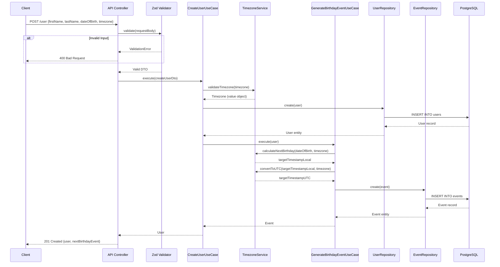
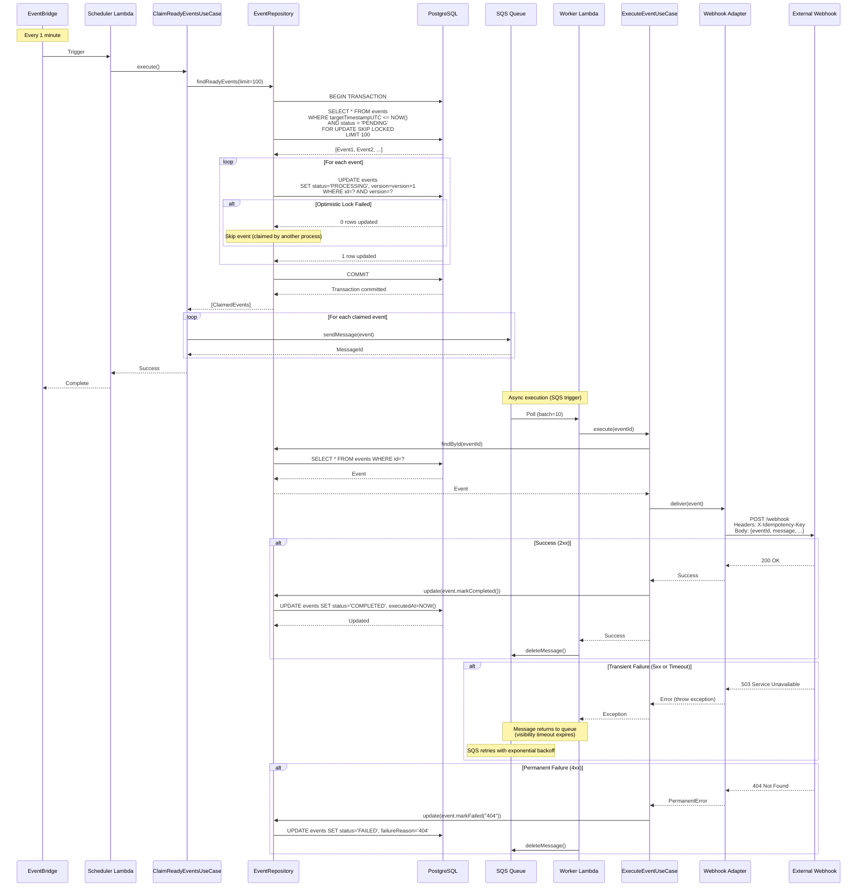
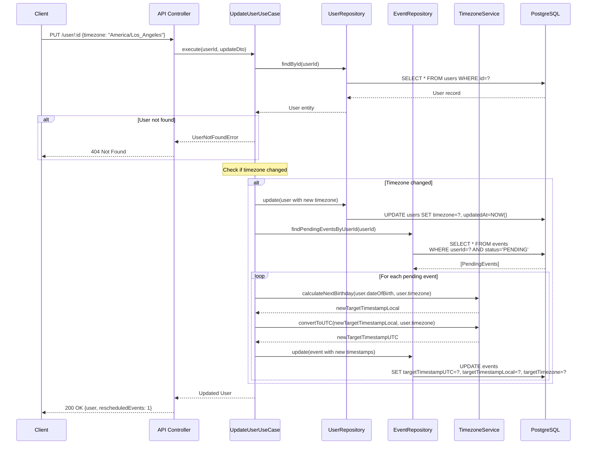
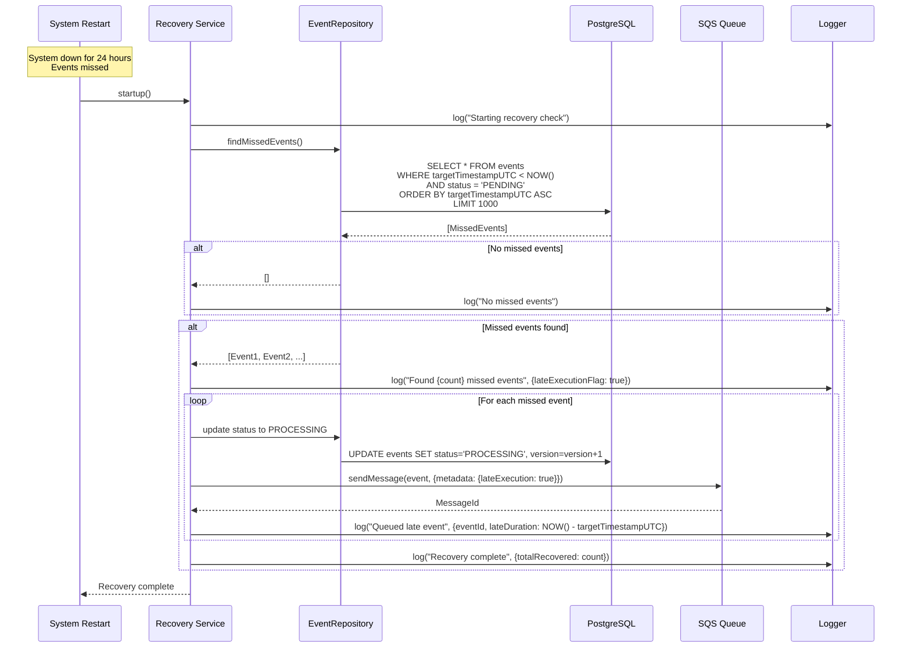

# Core Workflows

This section illustrates key system workflows using sequence diagrams to show component interactions, including error handling paths and async operations.

Reference: [Full Architecture Document](../architecture.md)

---

## Workflow 1: User Creation and Initial Event Generation

**Key Points:**

- Input validation happens at API boundary before reaching use cases
- Timezone validation ensures only valid IANA timezones are accepted
- Event generation is atomic with user creation (both succeed or both fail)
- Domain logic (timezone calculations) isolated in TimezoneService
- Database transactions ensure consistency

---

## Workflow 2: Scheduled Event Claiming and Execution

**Key Points:**

- `FOR UPDATE SKIP LOCKED` prevents race conditions (events locked by one scheduler instance are skipped by others)
- Optimistic locking (version field) provides secondary safeguard
- SQS decouples scheduler from executor (scheduler doesn't wait for webhook calls)
- Idempotency key prevents duplicate deliveries on retry
- Transient failures (5xx, timeout) trigger automatic retries via SQS
- Permanent failures (4xx) are marked FAILED without retry

---

## Workflow 3: User Timezone Update and Event Rescheduling

**Key Points:**

- Only PENDING events are rescheduled (PROCESSING/COMPLETED/FAILED events unchanged)
- Timezone recalculation uses same domain service as initial event generation
- All updates happen in transaction (user + events updated atomically)
- Client receives confirmation of how many events were rescheduled

---

## Workflow 4: Failure Recovery After System Downtime

**Key Points:**

- Recovery runs automatically on system startup
- Queries for events with target time in the past and PENDING status
- Late execution flag added to logs for observability
- Events processed through normal executor flow (same reliability guarantees)
- Recovery is idempotent (can run multiple times safely)
- No duplicate messages sent (same idempotency keys used)

---
